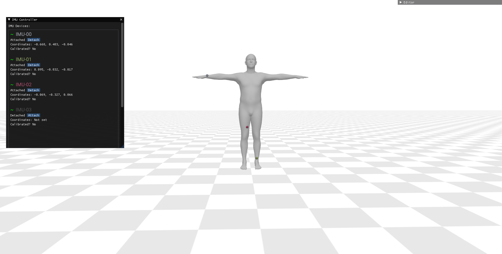

<div align="center">

<h1>🥥 IMUCoCo: Enabling Flexible On-Body IMU Placement for Human Pose Estimation and Activity Recognition</h1>
<div>
    <a href='https://haozheee.github.io/' target='_blank'>Haozhe Zhou</a>&emsp;
    <a href='https://rikky0611.github.io/' target='_blank'>Riku Arakawa</a>&emsp;
    <a href='https://www.synergylabs.org/yuvraj/' target='_blank'>Yuvraj Agarwal</a>&emsp;
    <a href='http://www.mayankgoel.com/' target='_blank'>Mayank Goel</a>&emsp;
</div>
<div>
    Carnegie Mellon University
</div>
<h4 align="center">
  This is the implementation of our paper IMUCoCo at UIST 2025. 
  <a href="https://smashlab.io/pdfs/imucoco.pdf" target='_blank'>[Paper]</a>
</h4>
</div>

## Repository Status

### ✅ Currently Available
- **Real-World Live Demo**: Interative real-time pose estimation demo system supporting flexible IMU placement with data streaming tool from commercial mobile and wearable devices.
- **IMUCoCo Model Training**: Full implementation of the IMUCoCo model with training scripts
- **Pretrained IMUCoCo**: Downloadable checkpoints of our trained model and loss map, ready to use for downstream tasks
- **Human Pose Estimation** Training and evaluation code for HPE task and trained HPE model checkpoint
- **Data Processing and IMU Synthesis**: Data generation and preprocessing for multiple pose and IMU datasets with full-body IMU data synthesis

### 📅 Coming Soon
- **Human Activity Recognition**: Training and evaluation pipeline activity recognition tasks with IMUCoCo
- **IMUCoCo Dataset**: Human pose dataset with densely placed commercial IMUs. Processed IMUCoCo's custom dataset with dataloaders

## Environment Setup

We tested our code on Ubuntu 22.04 LTS with `Python 3.10.13`, `Pytorch 2.9.0` with `cuda 12.8`, other dependencies are specified in `requirements.txt`.

```bash
conda create -n imucoco310 python=3.10.13
conda activate imucoco310
pip install torch==2.9.0 torchvision torchaudio --index-url https://download.pytorch.org/whl/cu128
pip install -r requirements.txt
```

**Note**: The PyTorch installation above is for CUDA 12.8. If you have a different CUDA version, please adjust the PyTorch installation command accordingly. You can find the appropriate commands at [PyTorch's official installation page](https://pytorch.org/get-started/locally/).

Visualization requires setting up the environment based on [aitviewer](https://github.com/eth-ait/aitviewer), which will require PyQT, OpenGL, etc. The configuration may depend on your os and architecture. Check their github issues if you face difficulties. 


## Trained IMUCoCo and Related Checkpoints
You can download our trained model checkpoints and related data here.
- [Trained IMUCoCo Model](https://synergylabs.org/haozhe/imucoco_best.pth)
- [Loss Map of the Trained IMUCoCo Model](https://synergylabs.org/haozhe/all_error_loss_map.pth)
- [Trained Human Pose Estimation Model](https://synergylabs.org/haozhe/poser_dtp_best.pth)

After downloading, place them into the `saved_checkpoints` directory in the root folder, or update `path_config.py` to point to them accordingly.

## Datasets and Models

### Datasets

We used several dataset sources, including AMASS, XSens Datasets (AnDY, UNIPD, Emokine, CIP, Virginia), DIP-IMU, TotalCapture. For evaluation of trained models, you can just download TotalCapture.
+ [AMASS](https://amass.is.tue.mpg.de/index.html)
+ [AnDy](https://zenodo.org/records/3254403) (xsens_mvnx.zip)
+ [UNIPD](https://doi.org/10.17605/OSF.IO/YJ9Q4)  (we use all the .mvnx files in single_person folder)
+ [Emokine](https://zenodo.org/records/7821844)
+ [CIP](https://doi.org/10.5281/zenodo.5801928)  (MTwAwinda.zip)
+ [Virginia Natural Motion](https://doi.org/10.7294/2v3w-sb92)
+ [DIP-IMU](https://dip.is.tue.mpg.de)
+ [TotalCapture](https://cvssp.org/data/totalcapture)

Download and extract the datasets into a `raw` folder and organize them into corresponding subdirectories as below. For XSens datasets (AnDY, UNIPD, Emokine, CIP, Virginia) keep them at XSens_MVNX.

```
pose_datasets_dir (change in path_config.py)
├─raw
│  ├─AMASS
|  |  ├─ACCAD, etc.
│  ├─DIP_IMU
|  |  ├─s_01, etc.
│  ├─TotalCapture
|  |  ├─dip_smpl, gyro_mag, imu, pos_ori, vicon
│  ├─XSens
|  |  ├─(empty)
│  ├─XSens_MVNX
|  |  ├─AnDy, etc.
└─parsed
```

### SMPL Models
We used the smpl model, download it from [here](https://smpl.is.tue.mpg.de) and place in  `./smpl/`.
```
smpl
├─SMPL_MALE.pkl
```

### Data Processing
Run the script to generate parsed data.
```bash
python data_generation.py --fullbody
```
**Note**: generating synthetic data of full body IMU requires a huge storage space (~8 TB). You can choose to `dataset_file_limit` to test with a smaller data size, or edit the code to generate at run time. If you don't want to train IMUCoCo model, you can generate without the `--fullbody` flag.


## Live Demo of Human Pose Estimation with Flexible IMU Placements
Download the required checkpoints (or supply your own) and update `path_config.py` before running any live demo.
### GUI
<p align="center">
  
</p>

Our live pose viewer buil aitviewer with tooling for IMU attachment management. The `IMU Controller` panel lists each device. The `~` indicator on the left shows connectivity and turns green when the device is online. Click `Attach`, then click on the avatar to place the sensor; a colored marker appears and matches the entry color in the controller. You can attach/detach as many devices as needed, but always stop inference before editing attachments.

### Live Pose Inference from Simulated IMU Data Streaming
Ensure you have prepare at least one `--fullbody` data sample with synthetic IMUs. 
Open three terminals.

**Terminal 1 – viewer**
```bash
python live_demo.py --viewer
```
This starts the GUI shown above. Initial slowness is normal while it tries to connect. This process manages attachments and rendering.

**Terminal 2 – server**
```bash
python live_demo.py
```
This is the motion server: it receives IMU packets, runs IMUCoCo + the pose model, and streams results back. When you see `Inference loop ready, waiting for INFERENCE_ON event...`, it is ready.

**Terminal 3 – IMU simulator**
```bash
python live_demo_simulation_data_sender.py
```
This streams the simulated IMU data. It also listens for attachment changes so each device follows its placement selected on the viewer. 

Once packets flow, the `~` indicators on the viewer should turn green. To attach any number of devices, simply click `Attach` and point on the avatart. Click `Start Inference` to see the live pose estimation. To change placements, hit `Stop Inference`, detach, and reattach. Different layouts highlight different body regions—for instance, two leg IMUs excel at gait but give limited upper-body fidelity.

### Live Pose Inference from Real Commercial Mobile and Wearable Device
Real-data inference mirrors the simulated workflow. We ship an iPhone + Apple Watch streaming app (watch must have an magnetometer). Make sure the phone/watch pair and your server/viewer machine share the same network. Device counts and UDP ports are defined near the top of `live_demo.py` and can be adjusted.

You only need two terminals (viewer + server). Follow the simulated-data instructions but skip the live_demo_simulation_data_sender. After the server prints the ready message, start the mobile app, pair the watch, and toggle streaming. The app UI should show ~50 FPS. By default pair #1 uses port 8001 and pair #2 uses 8002. You can easily modify the `live_demo.py` near the top if your setting is different. After the stream looks stable, tap “Create Socket” to begin sending packets; the `~` symbols for the matching devices in the viewer should turn green.

Real-world devices need the following calibration steps:

**Floor Alignment:**
Place every IMU flat on a table or on the floor, screens up, top edge pointing “forward” at your definition (Apple Watch crown on the right). Click the button and hold for a few seconds.

**T-Pose Calibration:**
Strap the devices on the user, attach them in the viewer (the avatar is not mirrored), ask the user to face the same “forward” direction and hold a T-pose, then click the button.

To start inference, simply click `Start Inference`. When you change attachment, you do not necessarily need to do the `Floor Alignment` again unless you experience drift. However, you should always rerun `T-Pose Calibration` for attachment changes. 

### System Compatibility
Tested on macOS (M1 Max) and Ubuntu 22.04 + NVIDIA GPU. Each platform needs slightly different GUI environment variables—review the definitions near the top of `live_demo.py` and adjust to match your setup.

## Evaluation of Downstream Tasks
**Note**: You do not need `--fullbody` data to perform training or evaluation of these tasks, but you do need parsed datasets plus the SMPL assets described above.

To evaluate downstream tasks, you need a trained IMUCoCo model and its loss map. You may download our pretrained model and loss map.


### Human Pose Estimation (HPE)
To evaluate, you will only need the TotalCapture dataset processed.
The `evaluate_imucoco_hpe.py` script handles both the training and evaluation of the pose estimation model. 

```bash
python evaluate_imucoco_hpe.py --test_tc 
```
When `--test_tc` is provided without a prior `--train` run in the same invocation, the script automatically loads the trained model from `saved_hpe_checkpoint_path` in `path_config.py`
Results (per placement case CSVs and log files) are stored in `exp_out/hpe/imu_coco_hpe_<exp_id>_dtp/`.

To train the pose estimation model, prepare your pretrained IMUCoCo model and loss map, process your AMASS, DIP-IMU, and XSens data, and update `path_config.py` accordingly. 
```bash
python evaluate_imucoco_hpe.py --train
```

<!-- ### Evaluating Human Activity Recognition
To evaluate:
```python
python evaluate_imucoco_har.py
```
To train:
```python
python evaluate_imucoco_har.py --train
``` -->

## Train IMUCoCo Model
You will need the `--fullbody` data for training. We trained using a 48GB L40S GPU. You may adjust the sampling size or batch size based on your GPU specs.

### End-to-End Training
To train the IMUCoCo model end-to-end with all phases, simplify run.
```python
python train_imucoco.py
```

### Individual Training Phases
The training process consists of three main steps:

- Phase 1: The model learns to predict pose and kinematics from virtual IMU data placed at joint locations to warm up the model quickly.
- Generate z_ref Cache: The model generates joint feature cache to serve as reference targets for Phase 2 training.
- Phase 2: The model learns to map a large amount of sampled virtual IMU data from the body mesh to joint features. 

You may use the following options to control the training of the individual phases.
- `--no_phase1`: Skip Phase 1 training (default: False)
- `--no_phase2`: Skip Phase 2 training (default: False)
- `--no_generate_z_ref`: Skip z_ref cache generation (default: False)
- `--exp_id`: Experiment ID number (default: 1)

### Generate IMUCoCo Loss Map
Phase 2 training and all downstream tasks expect a precomputed IMU-to-joint loss map so that we can quickly look up the best proxy vertices. After training IMUCoCo (or when using our released checkpoint), generate the map once and point `path_config.saved_imucoco_loss_map_path` to the resulting `.pth`.

```bash
python generate_imucoco_loss_map.py \
  --checkpoint_path saved_checkpoints/imucoco_best.pth \
  --dataset_path /path/to/pose_datasets \
  --num_samples 1000 \
  --save_dir exp_out/imu_coco_loss_map
```
Increase `--num_samples` to use more motion sequences to compute the loss map, but more samples lead to slower computation.
The script saves per-error heatmaps in `exp_out/imu_coco_loss_map/err_map/` and writes `all_error_loss_map.pth`. Update `path_config.saved_imucoco_loss_map_path` to point at this file before running Phase 2 or downstream tasks.

## Acknowledgement

The code repository and our model implementation has referred to several related works. We greatly appreciate the efforts in open-sourcing code from the authors of the follow amazing works:
+ [DynaIP](https://github.com/dx118/dynaip) <!-- MIT -->
+ [PNP](https://github.com/Xinyu-Yi/PNP), [TransPose](https://github.com/Xinyu-Yi/TransPose), [PIP](https://github.com/Xinyu-Yi/PIP)  <!--GPL-3.0-->
+ [MobilePoser](https://github.com/SPICExLAB/MobilePoser) <!-- CC NC SA 4.0 -->
+ [IMUPoser](https://github.com/FIGLAB/IMUPoser) <!-- NC Custom-->
+ [ST-GCN](https://github.com/yysijie/st-gcn) <!-- BSD-2-Clause-->

## Citation

If you find this project helpful, please consider citing us:

```
@inproceedings{zhou2025imucoco,
  title={IMUCoCo: Enabling Flexible On-Body IMU Placement for Human Pose Estimation and Activity Recognition},
  author={Zhou, Haozhe and Arakawa, Riku and Agarwal, Yuvraj and Goel, Mayank},
  booktitle={Proceedings of the 38th Annual ACM Symposium on User Interface Software and Technology},
  pages={1--16},
  year={2025},
  publisher={ACM},
  doi={10.1145/3746059.3747695}
}
```

## LICENSE

This project is licensed under the GNU General Public License v3.0 (GPL-3.0). See the [LICENSE](LICENSE) file for details.

**Note**: This project incorporates code from several open-source projects. Please refer to the [Acknowledgement](#acknowledgement) section for details and ensure compliance with their respective licenses.